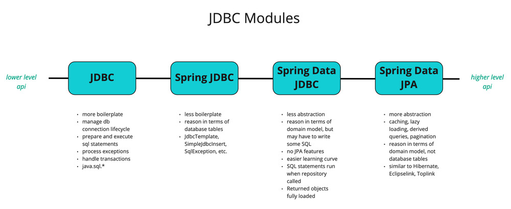
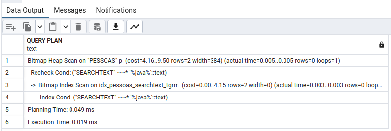
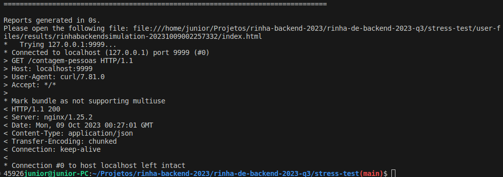
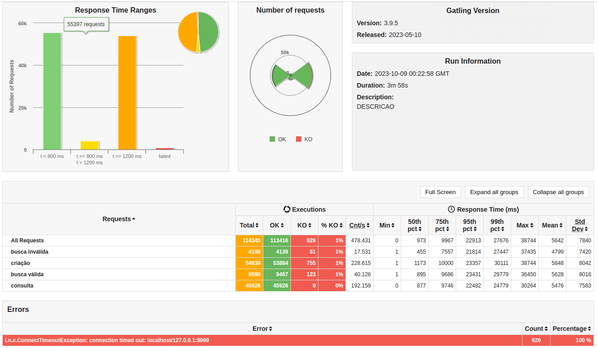
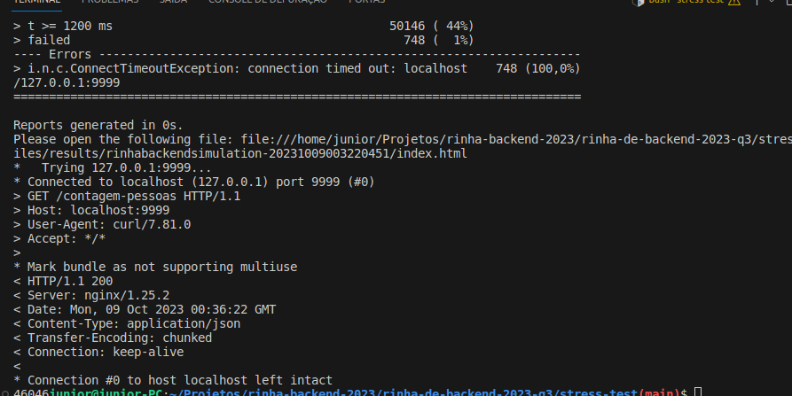
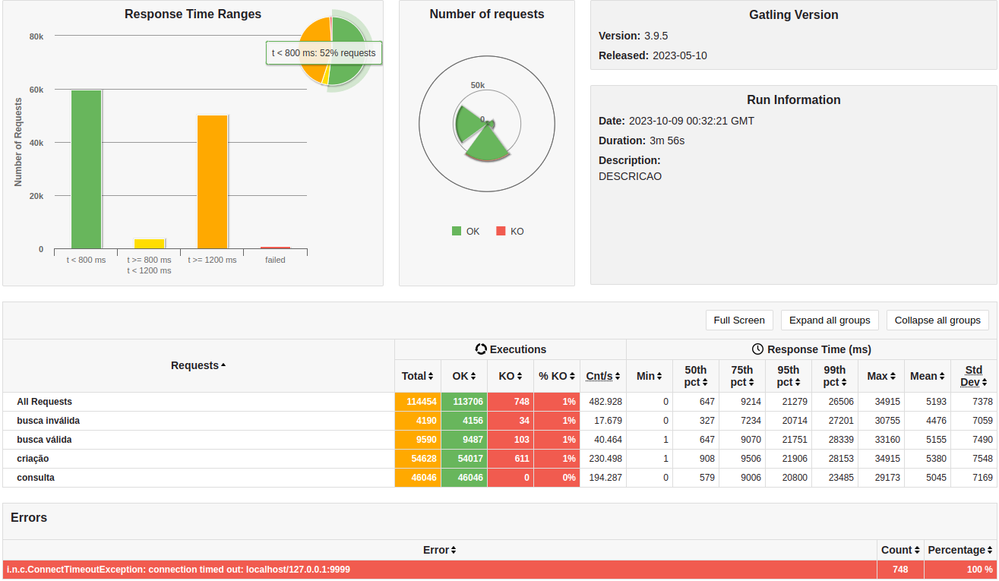

# Rinha de backend - Minha App

> Importante assistir os vídeos do Fabio Akira antes de ler o meu repo

## Objetivo

Fiquei sabendo da rinha de backend logo após ter acontecido e dos vídeos do [Fabio Akita](https://www.youtube.com/watch?v=EifK2a_5K_U) e do [MrPowerGameBR](https://www.youtube.com/watch?v=XqYdhlkRlus) publicados. Eu achei bem interessante e legal a dinâmica do desafio e assim como muitos outros não sou de competir, mas é interessante você se desafiar em contruir uma aplicação que chegue até os 46k de inserções.

Eu quis fazer algo para me divertir e também para sair da rotina, obviamente essa aplicação passa longe dos melhor 'design' por que o objetivo é fazer a aplicação aguentar a carga máxima.

## Regras

Como explicado no repo da rinha, as regras são:

* Construir uma aplicação backend que suporte os endpoints:
  * inserção de registros 
  * consulta por id
  * consulta por termo(onde ele pode ser o apelido, nome ou stack de programação)
  * contador de registros inseridos no banco(para fins de classificar o backend)
* Arquitetura
  * Um load balancer, o Nginx
  * 2 instâncias da aplicação
  * 1 banco de dados(Postgres, MongoDB ou MySQL)
* Ambiente
  * Docker/Docker Compose
  * 1.5CPU e 3GB para dividir como quiser entre os recursos
* Stack/Linguagem
  * A que você quiser.
* Quem ganha:
  * Quem conseguir inserir o maior número de pessoas.

## Stack & Desenvolvimento

* Java 17
* Spring boot
* Spring JDBC/HikariCP
* Postgres 16
* Nginx para Load Balancer

Acho que nessa descrição não há nada de novo, é uma stack padrão de quem utilizar Spring Boot, a única diferença é que optei por utilizar Spring Data JDBC diferente do Data JPA(Hibernate), isso por que nessa situação o Data JDBC gera SQL e executa via JDBC diferente do Spring Data que possui mais recursos como cache L1, Batch Operations, JPQL e etc. Que são recursos que eu não vou utilizar dado a natureza simples e direta da tabela no banco.



Links:
* [JDBC-VS-JPA Baeldung](https://www.baeldung.com/jpa-vs-jdbc)
* [Spring Data JPA para o Data JDBC](https://jpa-buddy.com/blog/spring-data-jpa-to-spring-data-jdbc-a-smooth-ride/)

Como mencionado nos vídeos toda galera trabalhou um cache, seja redis, nats ou em memória por que achavam que o banco não suportaria a carga, para o postgres mesmo com recursos limitados se sai extremamente bem com a carga de pesquisas e inserções no banco. O segredo maior é como indexamos uma busca por stack, apelido e nome no postgres, porque um dos critérios é que eu tenha uma busca dessa forma. 

Para isso utilizamos a funcionalidade de busca de texto do postgres, utilizando um índice GIST, esse é um dos dois tipos mais recomendados para esse fim. Existe o GIN, mas ele é melhor para dados estáticos ou em que os campos tenham textos maiores. Um truque também que eu peguei do PowerGameBR é que ele sabiamente resolveu contatenar todos os dados de busca em um único campo, assim diminui a busca do postgres de 3 campos para um somente.


Links: 
* [pg_trgm — support for similarity of text using trigram matching](https://www.postgresql.org/docs/current/pgtrgm.html#id-1.11.7.40.7)
* [using trigram indexes - Gitlab](https://about.gitlab.com/blog/2016/03/18/fast-search-using-postgresql-trigram-indexes/)
* [Postgres - GIN and GIST](https://www.postgresql.org/docs/9.1/textsearch-indexes.html#:~:text=For%20dynamic%20data%2C%20GiST%20indexes,but%20are%20slower%20to%20update).

OBS: é bom usar um explain analyse para ver se o seu indice é utilizado na busca :3



## Aprendizados

No fim das contas eu consegui chegar nos 46k de inserções com mais de 100k requests na aplicação pelo intervalo de 3min com 3GB de RAM e 1.5CPU para o Nginx, 2 instâncias do backend e Postgres.

Algumas coisas importantes que aprendi com essa rinha:

1. Nada que um bom teste de ‘stress’ ou carga para você avaliar se as configurações estão realmente otimizadas para o que você precisa.
2. Controlar o fluxo é extremamente importante, então o controle de números de workers do nginx e o número de conexões no banco ajudaram nisso.
3. Uma coisa que alguns devs não fazem, configurar o pool de conexões com teste e validação de conexões no banco, até o tempo de timeout ao esperar uma conexão, eu havia configurar antes para esperar apesar 3 segundos e com isso comecei a tomar toco, percebi que se aumentar isso ele consegue fazer a gestão do pool com mais eficiencia. 
4. Faça configuração de Xmx e Xms no Java, ele não é tão inteligente para saber que só tem ele no container funcionando. Antes de não tem feito essa configuração, ele alcançava no máximo metade do utilizado com maior utilização de CPU. 

Os cenários que cheguei mais próximo foram:

Cenário 1: 45.926 cadastros.





* Nginx
  * 8k workers
  * 0.1CPU
  * 300MB
* Aplicação(Cada instância)
  * 0.5CPU
  * 1GB
  * Xms e Xmx configurados paa 820MB, percebi que é necessário deixar pelo menos uns 180MB para o sistema e também para armazenamento non-heap do Java, com essa config ele chegou nos 980MB utilizados.
  * 40 conexões no pool com 25 segundos de timeout
* Banco:
  * 0.4CPU
  * 700MB


Cenário 2: 46.046 cadastros.





* Nginx
    * 7k workers
    * 0.1CPU
    * 300MB
* Aplicação(Cada instância)
    * 0.5CPU
    * 1GB
    * Xms e Xmx configurados paa 820MB, percebi que é necessário deixar pelo menos uns 180MB para o sistema e também para armazenamento non-heap do Java, com essa config ele chegou nos 980MB utilizados.
    * 40 conexões no pool com 25 segundos de timeout
* Banco:
    * 0.4CPU
    * 700MB

> Relatórios: os relatórios do Gatling estão na pasta reports
> Docker-Compose Modo Host: No Docker eu executei com a network no modo host, isso para evitar aquele Problema de PrematureClose, a rede interna do docker não aguenta a porrada.

## Como executar local

**Necessário possuir o Docker e Docker compose instalados, junto com Java 17 para construir a imagem**

1. Executar o script `build-jar-and-image.sh`
```shell
sh build-jar-and-image.sh
```

2. Executar o comando do docker compose
```shell
docker compose up
```

> OBS: Sei que não cheguei nos 46.476 que é o número de inserções máximas na app, e o meu o objetivo nem era esse, mas sim divertir um pouco :)

# Outros Links

* [Implementação do MrPowerGamerBR feita em Kotlin](https://github.com/MrPowerGamerBR/RinhaDeBackend2023Q3KotlinUnleashed/tree/main)
* [Repo Rinha de Backend Q3 2023](https://github.com/zanfranceschi/rinha-de-backend-2023-q3)
* [HikariCP](https://github.com/brettwooldridge/HikariCP)
* [HikariCP Config](https://howtodoinjava.com/spring-boot2/jpa-hibernate-hikaricp-config/)
* [List-vs-Stream Java](https://stackoverflow.com/questions/63115831/spring-data-repository-list-vs-stream)